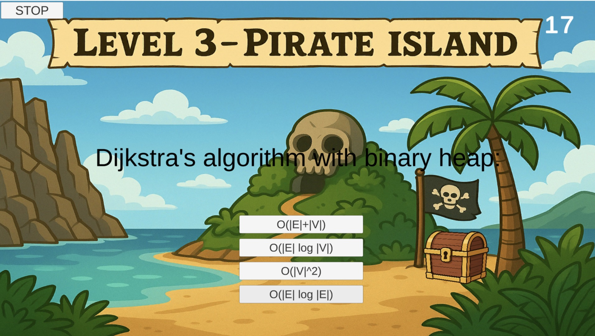

# README

## **Game Name**

**Big‑O Heist**

---

## **Developers**

* Listowel Anim ([animlist@udel.edu](mailto:animlist@udel.edu))
* Zhihua Sun ([sunzhi@udel.edu](mailto:sunzhi@udel.edu))
* Angel Asobo ([aasobo@udel.edu](mailto:aasobo@udel.edu))
* Junpuyin Wei ()

---

## **Blurb**

Big‑O Heist is an exciting, fast‑paced educational adventure that transforms algorithm analysis into a high‑stakes treasure hunt. Players must quickly determine the Big‑O time complexity of code snippets while a digital bomb ticks down and a hacker avatar reacts in real time. Correct answers open chests and advance you through three unique island scenes filled with puzzles, while wrong choices trigger immersive feedback teaching you the right solution. Perfect for students and coding enthusiasts, Big‑O Heist makes mastering algorithmic thinking both challenging and fun.

---

## **Basic Instructions**

1. Click **Start** to begin the game.
2. Read the code snippet displayed and choose the correct Big‑O complexity from four options.
3. Answer correctly to open the treasure chest and move to the next question or level.
4. A countdown timer adds urgency—answer before time runs out!
5. Wrong answers or time‑outs display an explanation panel and let you retry.

---

## **Screenshots**

  
*Start Screen: “WISE PIRATE – USE YOUR WEAPON: BIG‑O” with START button.*

  
*Level 1 gameplay with chest and timer.*

  
*Level 2 gameplay showing increasing difficulty.*

  
*Level 3 final questions in the cyber cave.*

  
*Failure Panel overlay with explanation text.*

  
*Feedback when answering correctly (chest opens).*

  
*Pause panel with Resume/Restart buttons.*
Pass Answers 13132, 12114, 22131
---

## **Gameplay Trailer**

"https://drive.google.com/file/d/10d73yOShV2QryUeHJ8qlrBjAQ4VFyy9_/preview"

---

## **Education Game Design Document**

Find the full EGDD here: [docs/egdd.md](docs/egdd.md)

---

## **Credits and Acknowledgements**

* **Background Images** by Freepik: [Tropical Island](https://www.freepik.com)
* **Chest Sprites** by Kenney.nl under CC0
* **Audio**: BGM loop by Pixabay (CC0), SFX by Freesound (CC0)
* **Tutorial references**: Unity official documentation, MDN Web Docs
* **Generative AI**: ChatGPT assisted in code structure and documentation writing.

---

## **Links**

* **Deployed Game**: [[(https://listowelll.github.io/CISC-374-Final-Project/)](https://listowelll.github.io/CISC-374-Final-Project/)]
* **Final Presentation**: [)
